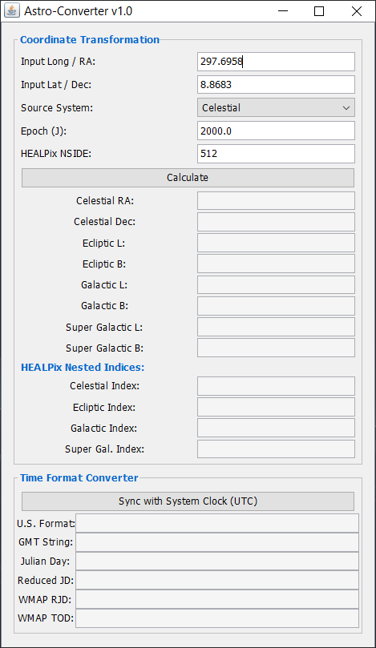

# High-Precision Supergalactic Coordinate Converter

A lightweight, professional-grade software layer designed to convert equatorial celestial coordinates (**ICRS / RA-Dec**) directly into **Supergalactic Coordinates (SGL-SGB)**. This documentation outlines the architectural concept, mathematical utility, compilation methods, and deployment layout of the transformation pipeline.



---

## Introduction

In computational astrophysics, mapping data structures across diverse spatial reference frames frequently introduces subtle positioning anomalies. These discrepancies typically manifest when algorithms rely on basic, uncompensated textbook formulas near the celestial poles. 

This project provides a precise, direct transformation matrix that bridges the gap between raw telescope observations and the flattened plane of the local supercluster of galaxies, ensuring structural uniformity for downstream data systems.

## Purpose & Utility

Standard coordinate conversion pipelines routinely suffer from data degradation because they treat astronomical transformations as isolated, static steps. Converting coordinates sequentially (e.g., Equatorial to Galactic, then Galactic to Supergalactic) inevitably introduces cumulative floating-point rounding errors. 

Furthermore, minor variations in defining the historical reference epoch (such as the shift between the legacy **B1950** baseline and the modern **ICRS J2000** standard) can warp coordinates by several degrees near the poles.

### Core Advantages
* **Elimination of Rounding Drift:** By combining the standard rotational components into a single matrix calculation, the processor executes the transformation in a single step, bypassing intermediate coordinates entirely.
* **Flawless Spatial Indexing:** Precision tracking of polar magnitudes preserves absolute alignment across coordinates. This guarantees that spatial database engines (such as HEALPix structures) accurately categorize high-latitude objects without creating positional "ghosting."
* **High-Throughput Performance:** Condensing the conversion into a singular, streamlined mathematical step heavily minimizes execution overhead, making the implementation ideal for multi-threaded catalog batch processing.

---

## Operational Workflow & HEALPix Indexing

The application operates as a deterministic, stateless math processor that seamlessly feeds into spatial indexing pipelines:

1. **Angular Standardization:** Input parameters for Right Ascension and Declination are mapped into spherical coordinate matrices.
2. **Matrix Projection:** A dedicated, pre-calculated row-major matrix maps the three-dimensional Cartesian vectors directly from the equatorial framework to the supergalactic target framework.
3. **Spherical Reconstruction:** The vector positions are translated back into standard spherical angles (Longitude and Latitude) using advanced quadrant-aware calculations to ensure values always map cleanly between 0° and 360°.
4. **Range Safeguards:** Advanced boundary constraints prevent vector overflows, protecting the stability of the tracking process against floating-point anomalies.
5. **HEALPix Spatial Mapping:** Once the precise Supergalactic Longitude (SGL) and Supergalactic Latitude (SGB) are resolved, these coordinates are immediately passed to a Hierarchical Equal Area isoLatitude Pixelation (HEALPix) engine. This process tessellates the celestial sphere into equal-area pixels, assigning the star a unique, fixed pixel ID for lightning-fast database spatial queries.

---

## Compilation & Execution Methods

### Prerequisites
* Java Development Kit (JDK) 11 or higher installed on your system.
* A standard HEALPix Java dependency library (configured via your build tool).

### Option 1: Apache Maven Build System (Recommended)
For production environments managing external HEALPix libraries, compile and build the software using the standard Maven lifecycle routines. 

### Build and Run Protocol

1. **Open your system terminal/command prompt** and navigate to the source directory containing pom.xml file:
   ```bash
   cd /path/to/pom.xml
   ```

2. **To package the application into an executable assembly** containing HEALPix libraries:
   ```bash
   mvn clean package
   ```

3. **Launch the core interactive terminal thread** via the main `aconverter` file:
   ```bash
   java -jar target/astro-converter-1.0-SNAPSHOT.jar
   ```

---

## Acknowledgments

Special thanks to the HEALPix (Hierarchical Equal Area isoLatitude Pixelation) team and collaboration group. This project heavily relies on their mathematical frameworks, pixelation algorithms, and software libraries to achieve efficient hierarchical indexing of the celestial sphere. Their dedication to open-source astrophysics tools enables reliable, high-throughput spatial database partitioning for modern astronomical catalogs.

## License & Contributions

### Open-Source Research License
This engine is distributed as an open-source academic utility under the **MIT License**. You are free to modify, fork, and integrate these modules into larger astrophysics pipelines, telescope scheduling packages, or hydrodynamic simulations, provided that the original copyright notice is retained.

### Academic Citation
If this engine or any of its localized analytical subsystems (e.g., the ultra-relativistic degeneracy models or the custom Parker wind solvers) are used to generate data, figures, or thresholds for peer-reviewed journal publications, please cite this repository as follows:
> *AsPhyEngine (2026). AsPhyEngine: High-Performance Internal Multi-Threaded Astrophysics Computational Workbench.*

### Support & Bug Reports
For core equation adjustments, boundary limit expansions, or to report syntax exceptions, please open an issue in the repository tracking board or contact the internal systems administrator.